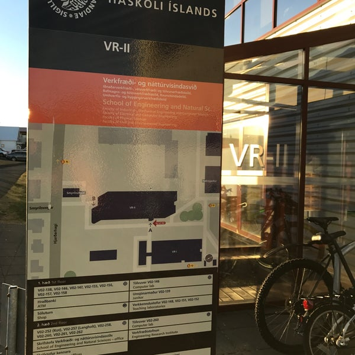



---

## Motivation

::: {.fa-card cols=1}
- building-columns | **Project-based courses** | Assessment often prioritizes final artifacts, limiting visibility into collaboration, reasoning, and responsiveness to feedback
- [brands] github | **Professional practice** | Modern technical work relies on version control, peer review, and documented iteration — skills students are expected to use immediately in the workforce
- scale-balanced | **Assessment misalignment** | What we value in learning is not always what we can currently observe
:::

::: {.notes}
Project-based courses are widely used — and we care about *collaboration*, *reasoning*, and *responsiveness to feedback*.

But in practice, assessment still prioritizes *final artifacts* — reports, code, presentations.

At the same time, professional work is inherently *collaborative* and *iterative*.

Version control, peer review, and documented iteration are not optional — they are core practice.

So the tension is this — what we value in learning is not always what we can actually *observe and assess*.
:::

---

## Framing the problem

::: {.fa-card cols=1}
- dumbbell | **Core question** | How can collaboration, accountability, and responsiveness to feedback be made _visible and assessable_ in team-based projects?
:::

[Three persistent challenges stand in the way:]{.lean-in}

::: {.fa-card cols=3}
- file-circle-xmark | **Final deliverables hide process** | Who did what, how decisions were made, and how feedback was handled is invisible in the final product
- eye-slash | **Peer interaction is difficult to audit** | Retrospective reconstruction of who reviewed, commented, or contributed is unreliable
- rotate-left | **Feedback resets instead of accumulating** | Each assignment starts from scratch — prior issues are not carried forward
:::

::: {.notes}
This leads to the core question —

How do we make *collaboration*, *accountability*, and *responsiveness to feedback* visible and assessable?

In team projects, the final deliverable hides most of what matters — who did what, how decisions were made, and how feedback was handled.

Peer interaction is difficult to reconstruct after the fact — and feedback often *resets* instead of accumulating.

So the issue is not lack of activity — it is lack of *visibility*.
:::

---

## Learning with professional collaboration tools

::: {.fa-card cols=1}
- toolbox | **Not just another tool** | Git/GitHub is an industry-standard collaboration infrastructure used across software, data science, and engineering teams
- repeat | **Version control, review, reproducibility** | Supports structured iteration, peer review, and documented handover — the core of professional technical work
- face-grin-stars | **Directly transferable** | Students practice skills they will immediately use — and can credibly list on their CV
:::

::: {.notes}
The approach is to use professional collaboration tools — not as an add-on, but as part of the learning environment.

Git and GitHub are widely used across technical fields.

They support *version control*, *peer review*, and *reproducibility*.

Importantly, these are skills students are expected to use immediately after graduation.

So this is not just about authenticity — it is about *transfer*.
Students practice what they will actually use.
:::

---

## Minimal GitHub concepts

[needed for assessment]{.slide-subtitle}

::: {.fa-card cols=1}
- database | **Repository** | A shared workspace containing code, data, documentation, and history — the persistent home for all project work
- code-pull-request | **Pull Request (PR)** | A structured proposal to change shared work: | * rationale and scope | * peer review and discussion | * explicit approval and merge decision
- key | **Key idea** | PRs bind technical change to collaborative process — making both visible and traceable
:::

::: {.notes}
Briefly aligning terminology —

A repository is a shared workspace containing code, data, and history.

A pull request — or PR — is a structured proposal to change shared work.

It includes a rationale, and is reviewed, discussed, and approved before merging.

The key idea is that PRs bind *technical change* to *collaborative process*.
:::

---

## Design rationale

::: {.fa-card cols=1}
- compass-drafting | **Starting point** | | * CDIO-aligned | * assessment as development | * observable collaboration
- key | **Design claim** | PRs are not a tooling detail — they are \_assessment infrastructure\_ | ~ [comments] feedback + [rotate] iteration ⟹ [medal] competence
:::

::: {.notes}
The design is CDIO-aligned and treats assessment as a *developmental process*.

The focus is on *observable collaboration*, not just outcomes.

The central claim is that pull requests are not just a tool — but can function as *assessment infrastructure*.

They make feedback and iteration visible — and over time this supports competence development.
:::

---

## Why pull requests matter

::: {.two-col}
::: {.fa-card cols=1}
- database | **Repository** | A shared workspace containing code, data, documentation, and history
- code-pull-request | **Pull Request (PR)** | A structured proposal with rationale, peer review, discussion, and explicit approval before merging
:::

::: {.fa-card cols=1}
- magnifying-glass | **Why it matters for assessment** | | * Reasoning becomes visible | * contribution becomes attributable | * critique is captured | * responses to feedback are auditable
- lightbulb | **Reframing** | PRs expose the learning process — not just the final product
:::
:::

::: {.notes}
A PR naturally contains what we want to assess —

rationale, critique, discussion, and decisions.

This means reasoning becomes *visible*,
contributions become *attributable*,
and responses to feedback become *auditable*.

So the reframing is simple — PRs expose the learning process.
:::

---

## Assessable behaviors made visible

::: {.fa-card cols=2}
- clipboard-list | **Required practices** | | * focused PRs with clear intent | * at least two substantive reviews | * explicit responses to all comments | * merge only after review
- user-check | **Observable evidence** | | * authorship and co-authorship | * depth of critique (no `LGTM` or [thumbs-up]) | * handover quality | * documentation updates
:::

```{=html}
<div class="stakeholders-diagram">
<!-- TikZ→SVG direct conversion: scale=60px/unit, SVG_x=tikz_x*60+10, SVG_y=(4.2-tikz_y)*60+35 -->
<!-- Lanes: main y=71, core-work y=119, feat-1 y=167, feat-2 y=215 -->
<svg viewBox="0 0 840 240" xmlns="http://www.w3.org/2000/svg"
     font-family="Jost, system-ui, sans-serif" font-size="12">
  <defs>
    <marker id="arr-orange" markerWidth="8" markerHeight="8" refX="7" refY="3" orient="auto">
      <path d="M0,0 L0,6 L7,3 z" fill="orange"/>
    </marker>
    <marker id="arr-gray" markerWidth="8" markerHeight="8" refX="7" refY="3" orient="auto">
      <path d="M0,0 L0,6 L7,3 z" fill="#888"/>
    </marker>
  </defs>

  <!-- Lane labels (anchor=east at tikz x=1.6 → SVG x=106) -->
  <text x="106" y="71" text-anchor="end" dominant-baseline="central" fill="#1a1a2e"><tspan font-family="monospace">main:</tspan> <tspan font-family="'Font Awesome 6 Free'" font-weight="900" fill="#10099f">&#xF0C0;</tspan> ABC</text>
  <text x="106" y="119" text-anchor="end" dominant-baseline="central" fill="#1a1a2e"><tspan font-family="monospace">core-work:</tspan> <tspan font-family="'Font Awesome 6 Free'" font-weight="900" fill="#10099f">&#xF007;</tspan> A</text>
  <text x="106" y="167" text-anchor="end" dominant-baseline="central" fill="#1a1a2e"><tspan font-family="monospace">feat-1:</tspan> <tspan font-family="'Font Awesome 6 Free'" font-weight="900" fill="#10099f">&#xF007;</tspan> B</text>
  <text x="106" y="215" text-anchor="end" dominant-baseline="central" fill="#1a1a2e"><tspan font-family="monospace">feat-2:</tspan> <tspan font-family="'Font Awesome 6 Free'" font-weight="900" fill="#10099f">&#xF007;</tspan> C</text>

  <!-- Main branch: m0(190,71) — m1(526,71) — m2(658,71) -->
  <line x1="190" y1="71" x2="658" y2="71" stroke="#1a1a2e" stroke-width="1.5"/>
  <circle cx="190" cy="71" r="4" fill="#1a1a2e"/>
  <circle cx="526" cy="71" r="4" fill="#1a1a2e"/>
  <circle cx="658" cy="71" r="4" fill="#1a1a2e"/>
  <text x="190" y="53" text-anchor="middle" font-size="11" font-style="italic" fill="#555">template</text>
  <text x="658" y="53" text-anchor="middle" font-size="11" font-style="italic" fill="#555">final result</text>

  <!-- core-work: curve m0→a1 [controls (3.3,3.3)(3.6,3.0) → C(208,89)(226,107)], then a1—a5 -->
  <path d="M190,71 C208,89 226,107 250,119" stroke="#1a1a2e" stroke-width="1.5" fill="none"/>
  <circle cx="250" cy="119" r="4" fill="#1a1a2e"/>  <!-- a1 x=4.0 -->
  <circle cx="310" cy="119" r="4" fill="#1a1a2e"/>  <!-- a2 x=5.0 -->
  <circle cx="376" cy="119" r="4" fill="#1a1a2e"/>  <!-- a3 x=6.1 -->
  <circle cx="442" cy="119" r="4" fill="#1a1a2e"/>  <!-- a4 x=7.2 -->
  <circle cx="550" cy="119" r="4" fill="#1a1a2e"/>  <!-- a5 x=9.0 -->
  <line x1="250" y1="119" x2="550" y2="119" stroke="#1a1a2e" stroke-width="1.5"/>

  <!-- feat-1 (B): curve a2→b1 [controls (5.2,2.5)(5.4,2.2) → C(322,137)(334,155)], b1—b2, PR b2→a4 -->
  <path d="M310,119 C322,137 334,155 352,167" stroke="#1a1a2e" stroke-width="1.5" fill="none"/>
  <circle cx="352" cy="167" r="4" fill="#1a1a2e"/>  <!-- b1 x=5.7 -->
  <circle cx="400" cy="167" r="4" fill="#1a1a2e"/>  <!-- b2 x=6.5 -->
  <line x1="352" y1="167" x2="400" y2="167" stroke="#1a1a2e" stroke-width="1.5"/>
  <!-- PR merge b2→a4 [controls (7.0,2.15)(7.1,2.45) → C(430,158)(436,140)] -->
  <path d="M400,167 C430,158 436,140 442,119" stroke="orange" stroke-width="3" fill="none" marker-end="url(#arr-orange)"/>

  <!-- feat-2 (C): curve m0→c1 [controls (3.2,3.0)(3.7,1.5) → C(202,107)(232,197)] -->
  <path d="M190,71 C202,107 232,197 268,215" stroke="#1a1a2e" stroke-width="1.5" fill="none"/>
  <circle cx="268" cy="215" r="4" fill="#1a1a2e"/>  <!-- c1 x=4.3 -->
  <line x1="268" y1="215" x2="370" y2="215" stroke="#1a1a2e" stroke-width="1.5"/>  <!-- c1—c2 black -->
  <circle cx="370" cy="215" r="4" fill="#1a1a2e"/>  <!-- c2 x=6.0 -->
  <line x1="370" y1="215" x2="448" y2="215" stroke="orange" stroke-width="3"/>     <!-- c2—c3 PR -->
  <circle cx="448" cy="215" r="4" fill="#1a1a2e"/>  <!-- c3 x=7.3 -->
  <line x1="448" y1="215" x2="484" y2="215" stroke="orange" stroke-width="3"/>     <!-- c3—c4 PR -->
  <circle cx="484" cy="215" r="4" fill="#1a1a2e"/>  <!-- c4 x=7.9 -->
  <!-- PR merge c4→m1 [controls (8.4,1.9)(8.5,3.0) → C(514,173)(520,107)] -->
  <path d="M484,215 C514,173 520,107 526,71" stroke="orange" stroke-width="3" fill="none" marker-end="url(#arr-orange)"/>

  <!-- sync dashed m1→a5 [controls (8.7,3.25)(8.9,3.0) → C(532,92)(544,107)] -->
  <path d="M526,71 C532,92 544,107 550,119" stroke="#888" stroke-width="1.2" stroke-dasharray="5,4" fill="none" marker-end="url(#arr-gray)"/>
  <text x="536" y="88" font-size="10" font-style="italic" fill="#888">sync</text>

  <!-- core-work PR merge a5→m2 [controls (9.5,3.05)(10.0,3.35) → C(580,104)(610,86)] -->
  <path d="M550,119 C580,104 610,86 658,71" stroke="orange" stroke-width="3" fill="none" marker-end="url(#arr-orange)"/>

  <!-- Right-side annotations (anchor=west at tikz x=11.7 → SVG x=712) -->
  <text x="712" y="71" dominant-baseline="central" font-size="11" font-style="italic" fill="#555">feedback: </text>
  <foreignObject x="775" y="62" width="22" height="18">
    <div xmlns="http://www.w3.org/1999/xhtml" style="line-height:1"><i class="fa-solid fa-chalkboard-user" style="color:#10099f;font-size:13px"></i></div>
  </foreignObject>
  <text x="712" y="119" dominant-baseline="central" font-size="11" font-style="italic" fill="#555">review: <tspan font-family="'Font Awesome 6 Free'" font-weight="900" font-style="normal" fill="#10099f">&#xF007;</tspan> B, <tspan font-family="'Font Awesome 6 Free'" font-weight="900" font-style="normal" fill="#10099f">&#xF007;</tspan> C</text>
  <text x="712" y="167" dominant-baseline="central" font-size="11" font-style="italic" fill="#555">review: <tspan font-family="'Font Awesome 6 Free'" font-weight="900" font-style="normal" fill="#10099f">&#xF007;</tspan> A, <tspan font-family="'Font Awesome 6 Free'" font-weight="900" font-style="normal" fill="#10099f">&#xF007;</tspan> C</text>
  <text x="712" y="215" dominant-baseline="central" font-size="11" font-style="italic" fill="#555">review: <tspan font-family="'Font Awesome 6 Free'" font-weight="900" font-style="normal" fill="#10099f">&#xF007;</tspan> A, <tspan font-family="'Font Awesome 6 Free'" font-weight="900" font-style="normal" fill="#10099f">&#xF007;</tspan> B</text>
</svg>
</div>
```

::: {.notes}
We define specific required practices.

Students submit focused PRs, receive at least two *substantive* reviews,
and respond explicitly to all comments.

Substantive means actionable feedback — not just superficial approval.

Assessment then uses observable evidence — authorship, critique, follow-up, and handover.

So assessment shifts from hidden process to *visible artifacts*.
:::

---

## Scaffolded progression

[_across courses_]{.slide-subtitle}

::: {.fa-card cols=2}
- user | **Information Engineering (IE)** | | * 20–25 students, 6–7 small teams | * early undergraduate | * new repository each cycle | * focus: learning the tools
- user-graduate | **Business Intelligence (BI)** | | * 10–15 students, 2 large teams | * assumes GitHub fluency | * single persistent repository | * focus: tooling supports advanced project work
:::

::: {.notes}
This is implemented across two courses.

In Information Engineering, the focus is learning the tools — small teams, repeated practice, new repositories.

In Business Intelligence, students are assumed fluent — one persistent repository across the semester.

So there is progression — from learning the workflow to using it as *infrastructure*.
:::

---

## Feedback carry-forward

::: {.fa-card cols=2}
- arrows-rotate | **Cumulative assessment** | | * unresolved PR comments remain active | * later work is checked against prior feedback | * capstone evaluation includes earlier issues
- bullseye | **Effect** | | * continuity | * accountability | * coherence | * less fragmentation across assignments
:::

::: {.notes}
When teams are working with a single, persistent repository, feedback can carry forward — it doesn't reset between assignments.

If an issue is raised in a pull request and not resolved, it remains visible in the repository.

Later work is then evaluated in light of that earlier feedback — including in the capstone.

So feedback accumulates over time rather than fragmenting across tasks.

This creates *continuity* and *accountability*.

Students cannot simply move on — they have to revisit and resolve issues.

And that is much closer to professional practice.
:::

---

## Indicative evidence

<div class="rubric-table">

|  | **Outstanding** | **Good** | **Developmental** |
|---|---|---|---|
| GitHub usage | Branches well organized, logical names. Commits coherent and descriptive. Documentation complete. | Branches used but naming inconsistent. Commits mostly coherent. Documentation present but incomplete. | Branches absent or unclear. Commits inconsistent, little structure. Documentation unclear or missing. |
| Teamwork | All members actively contribute. Responsibilities distributed. Decisions shared through review. | Most members participate, contributions uneven. One or two lead while others review. | Work largely carried by one individual. Participation minimal or uneven. |

</div>

::: {.fa-card cols=2}
- arrow-trend-up | **Calibration** | | * levels: developmental → outstanding | * same dimensions, increasing expectations | * signals what Capstone requires
- chart-line | **Observed trend** | | * GitHub usage improved over repeated cycles | * teamwork & participation improved more strongly
:::

::: {.notes}
To clarify the rubric design —

The GitHub usage and teamwork dimensions are *shared across both courses*.
Early on, we are deliberately *lenient* — students are still learning the workflow.

We observe improvement in GitHub use and stronger improvement in teamwork and participation.
Qualitatively, PRs become more focused, better documented, and more responsive.

In the BI course, each thematic module also has its own rubric —
and these are *reused directly in the capstone*.

During the learning phase, grading is *normalized to "very good"*.
So students are not penalized for early-stage work —

but they are explicitly shown what will be expected in a more *refined, final version*.
:::

---

## Team and individual accountability

::: {.fa-card cols=2}
- users | **Team-level** | | * analytical quality | * coherence | * shared responsibility for outcomes
- user-check | **Individual-level** | | * visible contributions | * review quality | * responsiveness to feedback
:::

::: {.fa-card cols=1}
- scale-balanced | **Design goal** | accountability without fragmenting teamwork
:::

::: {.notes}
A common concern is balancing team and individual assessment.

Team-level outcomes still matter — quality and coherence.

But individual contribution becomes visible through artifacts — commits, reviews, and discussion.

The goal is *accountability* without breaking *collaboration*.
:::

---

## Key shifts in practice

::: {.fa-card cols=3}
- shield-halved | **Quality** | Iteration vs. reviewable work
- users | **Collaboration** | Implicit teamwork vs. explicit review
- laptop-code | **Workflow** | Informal work vs. structured process
:::

::: {.fa-card cols=1}
- lightbulb | **Takeaway** | Making collaboration visible turns implicit practices into something we can teach and assess
:::

::: {.notes}
What PR-based workflows do is make collaboration practices *explicit*.

Students are not used to reviewing each other's work critically.
That's not a problem — it's something we need to *teach and normalize*.

Similarly, work becomes visible much earlier.
Students can no longer rely on polishing something at the end — they have to produce work that can be reviewed along the way.

And the workflow itself introduces structure.
That can feel like overhead, but it is also what enables learning — especially around collaboration and feedback.

So rather than thinking of these as problems or tensions,
they are *practices becoming visible* — and therefore teachable.
:::

---

## Limitations and next steps

::: {.fa-card cols=2}
- lock | **Boundary conditions** | | * design-oriented, not experimental | * depends on student readiness | * larger cohorts require more coordination
- arrow-trend-up | **Next iterations** | | * extend to more courses | * structured team-building to accelerate trust | * refined review calibration
:::

::: {.notes}
There is definitely some initial overhead — especially around learning the workflow and review practices.

Students are not used to this level of structure or visibility.

It also depends on readiness — this works much better once basic tooling is already in place.

And scaling requires coordination, particularly around review quality.

So this is not a drop-in solution — it needs to be designed into the course.
:::

---

## Conclusions

::: {.fa-card cols=1}
- flag-checkered | **Key takeaway** | PR-based assessment makes collaboration, accountability, and responsiveness to feedback visible and assessable
- arrow-right | **Assessment shifts** | | * from final products to visible process | * feedback carries forward instead of resetting | * students practice professional collaboration in routine coursework
- lightbulb | **Contribution** | This is an assessment architecture, not just a tool choice
:::

::: {.notes}
The key takeaway is that making collaboration visible fundamentally changes what we can assess.

There is an initial overhead — students don't always enjoy the structure at first.
Reviewing peers, documenting work, responding to feedback — this is unfamiliar and effortful.

But over time, the quality of work improves significantly.
Work becomes more structured, better justified, and more coherent.

And importantly, students recognize this afterwards.
Many of them explicitly say that this is where they learned the most — not just the content, but how to actually work.

So the impact is not just in what they produce —
it's in how they approach collaboration, feedback, and responsibility.

And that comes from the *assessment structure*, not the specific subject matter.
:::

---

## Questions? {.contact-slide}

::: {.two-col}
::: {.col}
{.contact-photo}
:::

::: {.col}
```{=html}

```
:::
:::

::: {.notes}
A few questions that often come up —

*Isn't this a lot of overhead?*
Yes — there is initial overhead.
But it decreases quickly, and the payoff is that assessment becomes much easier and more transparent later.

*What about students with no GitHub experience?*
We scaffold this earlier in the curriculum.
In later courses, we assume fluency so the tooling does not dominate the learning.

*Does this scale?*
It can scale, but requires coordination — especially around review practices.
The visibility actually helps manage larger groups.

*How do you ensure fairness in team assessment?*
Individual contributions are visible through PRs, reviews, and discussion.
So we don't rely only on peer evaluation — we have *artifact-based evidence*.

*Is this specific to software or data courses?*
The tooling is domain-specific, but the principle is not.
The idea is to make process and feedback visible — the same logic can apply elsewhere.

*Is this just about GitHub?*
No — GitHub is the *enabler*.
The contribution is the *assessment architecture*.
:::
